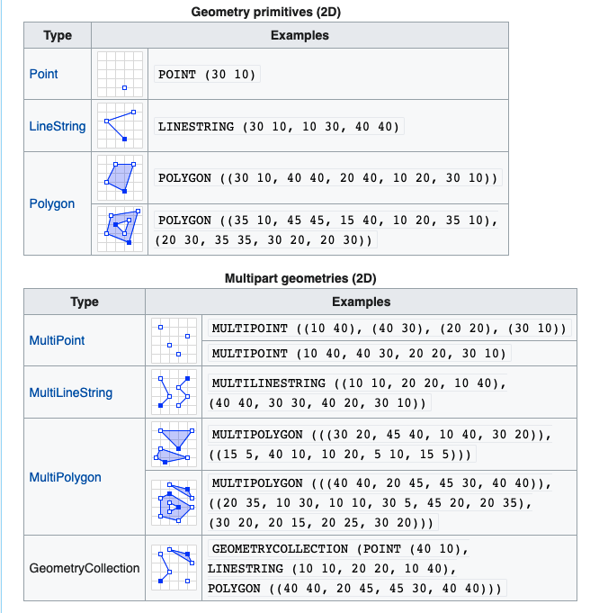
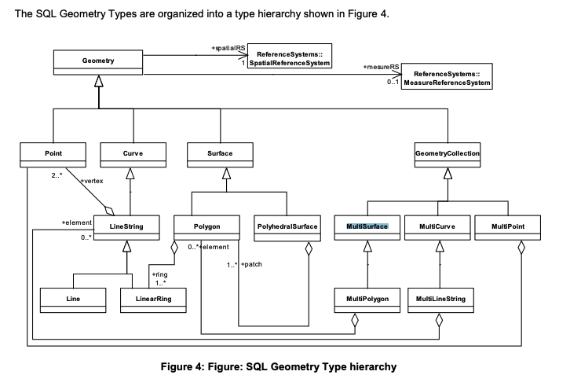

## Understanding Web Geospatial Standards & technologies

### Simple Features

- **Simple Features:**  set of standards that specify a common storage and access model of geographic feature made of mostly two-dimensional geometries (point, line, polygon, multi-point, multi-line, etc.) used by geographic information systems. It is formalized by both the Open Geospatial Consortium (OGC) and the International Organization for Standardization (ISO).
  - **ISO 19125: 2 Parts:**
    - **Part 1:** defines a model for two-dimensional simple features, with linear interpolation between vertices, defined in a hierarchy of classes; this part also defines representation of geometry in text (WKT) and binary (WKB) forms.
    - **Part 2:** defines a "SQL/MM" language binding API for SQL under the prefix "SF_".[1] 
  - **ISO/IEC 13249-3 SQL/MM Spatial** extends the Simple Features data model mainly with circular interpolations (e.g. circular arcs) and adds other features like coordinate transformations and methods for validating geometries as well as Geography Markup Language support.[1]

### Well-known text (WKT) 

Well-known text (WKT) is a **text markup language for representing vector geometry objects**. A binary equivalent, known as well-known binary (WKB), is used to transfer and store the same information in a more compact form convenient for computer processing but that is not human-readable. The **formats were originally defined by the Open Geospatial Consortium (OGC)** and described in their [Simple Feature Access.[1]](https://www.ogc.org/standards/sfa) The current standard definition is in the ISO/IEC 13249-3:2016 standard.[2]

Form the Simple Features Access site:

> Currently, the ISO 19125: Simple Features SWG is working to update the OGC Simple Features standards. The purpose of the ISO 19125 SWG is to update the common standard that is both the OGC Simple Features Implementation Standard and the ISO 19125 Standards (Part 1: Common Architecture, and Part 2 SQL Option) to: 
>
> - Maintain and correct the current standard, 
- Synchronize with SQL/MM: Part 3 Spatial,
- Introduce new geometry types,
- Support 3D coordinates, and Linear reference systems including segmented attributes.

#### WKT Geometric objects
WKT can represent the following distinct geometric objects:

- Point, MultiPoint
- LineString, MultiLineString
- Polygon, MultiPolygon, Triangle
- PolyhedralSurface
- TIN (Triangulated irregular network)
- GeometryCollection

Coordinates for geometries may be 2D (`x`, `y`), 3D (`x, y, z`), 4D (`x, y, z, m`) with an `m` value that is part of a linear referencing system or 2D with an `m` value (`x, y, m`). Three-dimensional geometries are designated by a "Z" after the geometry type and geometries with a linear referencing system have an "M" after the geometry type. 

WKT geometries are used throughout OGC specifications and are present in applications that implement these specifications. 

The OGC standard definition requires a polygon to be topologically closed. It also states that if the exterior linear ring of a polygon is defined in a counterclockwise direction, then it will be seen from the "top". Any interior linear rings should be defined in opposite fashion compared to the exterior ring, in this case, clockwise.[3]

#### Format variations

##### EWKT and EWKB – Extended Well-Known Text/Binary
A **PostGIS-specific format** that **includes the spatial reference system identifier (SRID)** and up to 4 ordinate values (XYZM). For example: `SRID=4326;POINT(-44.3 60.1)` to locate a longitude/latitude coordinate using the WGS 84 reference coordinate system. It also supports circular curves, following elements named (but not fully defined) within the original WKT: `CircularString`, `CompoundCurve`, `CurvePolygon` and `CompoundSurface.`

Source: OGC 06-104r4

### Glossary:

#### **Open Geospatial Consortium (OGC)**, 

an international voluntary consensus standards organization, originated in 1994. In the OGC, more than 500 commercial, governmental, nonprofit and research organizations collaborate in a consensus process encouraging development and implementation of open standards for geospatial content and services, sensor web and Internet of Things, GIS data processing and data sharing.

#### [**Web Feature Service**](https://en.wikipedia.org/wiki/Web_Feature_Service): 

In computing, the Open Geospatial Consortium Web Feature Service (WFS) Interface Standard provides an interface allowing requests for geographical features across the web using platform-independent calls. In early 2006 the OGC members approved the OpenGIS GML Simple Features Profile.[1] This profile is designed both to increase interoperability between WFS servers and to improve the ease of implementation of the WFS standard. 
  
  The OGC membership defined and maintains the WFS specification. Numerous commercial and open-source implementations of the WFS interface standard exist, including the open-source reference implementations GeoServer and deegree. The OGC Implementing Products page[2] provides a comprehensive list of WFS implementations.

##### Data

Data passed between a Web Feature Server and a client is encoded with Geography Markup Language (GML), an XML dialect which can be used to model geographic features.

- The 1.0.0 version of the WFS specification requires the use of GML version 2.1.2, while the **1.1.0 version of the WFS specification requires the use of GML version 3.1.1.** For both versions of the WFS specification, an arbitrary number of other encodings can also be defined, in addition to the required GML 2.1.2 or 3.1.1 format (for 1.0.0 and 1.1.0 respectively).

- GML 2.1.2 contains encoding support for basic geometric 'primitives': points, lines, polygons, etc.

- GML 3.1.1 contains encoding support for more advanced geometric representations: curves, surfaces, multi-dimensions (time, elevation, multi-band imagery). In addition, GML 3.1.1 includes encoding support for topologically integrated datasets.
  
##### Static Interfaces
The static interface model for the OGC Web Service model appears in the figure below. The Transaction and LockFeature operations are also optional.

When writing a WFS, you must implement the following operations:

- `GetCapabilities` - this queries the WFS service to determine available options.
- `DescribeFeatureType` - this retrieves the XML schema to allow the WFS client to parse the resultsets.
- `GetFeature` - this performs the actual query - parameters such as bounding box and any other filters should be passed in, as appropriate, and the WFS service then returns a GML resultset containing full geometry and feature attributes.

### DE-9IM

The **Dimensionally Extended 9-Intersection Model (DE-9IM)** is a **topological model and a standard** used to **describe the spatial relations of two regions** (two geometries in two-dimensions, R2), in geometry, point-set topology, geospatial topology, and fields related to computer spatial analysis. The spatial relations expressed by the model are invariant to rotation, translation and scaling transformations.

The **matrix provides an approach for classifying geometry relations**. Roughly speaking, with a true/false matrix domain, there are 512 possible 2D topologic relations, that can be grouped into binary classification schemes. The English language contains about **10 schemes (relations)**, such as "intersects", "touches" and "equals". **When testing two geometries against a scheme, the result is a spatial predicate named by the scheme.**

**It has been used as a basis for standards of queries and assertions in geographic information systems (GIS) and spatial databases.**

#### Matrix model

The DE-9IM model is based on a 3×3 intersection matrix where `dim` is the dimension of the intersection (∩) of the interior (I), boundary (B), and exterior (E) of geometries a and b.

#### Spatial predicates

Any topological property based on a DE-9IM binary spatial relation is a spatial predicate. For ease of use "named spatial predicates" have been defined for some common relations, which later became standard predicates. The spatial predicate functions that can be derived from DE-9IM include:

The Open Geospatial Consortium (OGC) has **standardized the typical spatial predicates (Contains, Crosses, Intersects, Touches, etc.) as boolean functions, and the DE-9IM model as a function that returns a string (the DE-9IM code)**, with domain of {0,1,2,F}, meaning 0=point, 1=line, 2=area, and F="empty set". This DE-9IM string code is a standardized format for data interchange.

The Simple Feature Access (ISO 19125) standard,[17] in the chapter 7.2.8, "SQL routines on type Geometry", recommends as supported routines the SQL/MM Spatial[18] (ISO 13249-3 Part 3: Spatial) ST_Dimension, ST_GeometryType, ST_IsEmpty, ST_IsSimple, ST_Boundary for all Geometry Types. The same standard, consistent with the definitions of relations in "Part 1, Clause 6.1.2.3" of the SQL/MM, recommends (shall be supported) the function labels: ST_Equals, ST_Disjoint, ST_Intersects, ST_Touches, ST_Crosses, ST_Within, ST_Contains, ST_Overlaps and ST_Relate.

The DE-9IM in the OGC standards use the following definitions of Interior and Boundary, for the main OGC standard geometry types:[19]

#### Implementation and practical use

Most spatial databases, such as PostGIS, implements the DE-9IM() model by the standard functions: `ST_Relate`, `ST_Equals`, `ST_Intersects`, etc. The function `ST_Relate(a,b)` outputs the standard OGC's DE-9IM string code.

## Important Libraries

### PROJ

**`PROJ`** (formerly PROJ.4) is a **library for performing conversions between cartographic projections.** The library is based on the work of Gerald Evenden at the United States Geological Survey (USGS),[2] but since 2019-11-26 is an Open Source Geospatial Foundation (OSGeo) project maintained by the PROJ Project Steering Committee (PSC). The library also ships with executables for performing these transformations from the command line.

With the release of version 5.0 in February 2018, the software was renamed to PROJ, removing version four (".4") from the name. With the acquisition of the proj.org domain name in June 2019, the project was also renamed as PROJ.

#### Recent changes in PROJ and consequences:

Several reasons have led to recent changes in GDAL and PROJ, such as the former use of the WGS84 CRS as an intermediate ‘hub’ in coordinate transformation or in defining a CRS’s datum (introducing unneeded errors), higher accuracy requirements in transformations and the availability of better CRS specification standards than PROJ strings. The changes are included in GDAL 3 and PROJ ≥ 6, which many R packages now support and promote. In consequence, support for PROJ strings to represent a CRS is reduced and discouraged. It can still be done, preferrably adding the `+type=crs` element.

The current approach is the WKT2 string, a recent and much better standard, maintained by the Open Geospatial Consortium. WKT stands for ‘Well-known text.’ ‘WKT2’ is simply the recent version of WKT, approved in 2019, so you can also refer to it as WKT.

##### Well-known text representation of coordinate reference systems

Well-known text representation of coordinate reference systems (WKT or WKT-CRS) is a text markup language for representing spatial reference systems and transformations between spatial reference systems. The formats were originally defined by the Open Geospatial Consortium (OGC) and described in their Simple Feature Access[1] and Well-known text representation of coordinate reference systems[2] specifications. The current standard definition is ISO 19162:2019.[3] This supersedes ISO 19162:2015.[4]

##### DO:

The general principle that we recommend is: **specify the CRS by using the EPSG code, but do so without using a PROJ string**.

Note: in case you wish to define a **custom CRS yourself, ideally use WKT2** or its more convenient PROJJSON counterpart.

#### DON’T:

It’s **no longer advised to use PROJ strings to specify a CRS**, such as `+init=epsg:????`, `+proj=longlat`, … (even though that might still work, their usage is discouraged).

## Resources:

- [Lesson 5. GIS in R: Understand EPSG, WKT and other CRS definition styles](https://www.earthdatascience.org/courses/earth-analytics/spatial-data-r/understand-epsg-wkt-and-other-crs-definition-file-types/)
- [Goodbye PROJ.4! How to specify a coordinate reference system in R?](https://inbo.github.io/tutorials/tutorials/spatial_crs_coding/)
- [Recent changes in R spatial and how to be ready for them](https://geocompr.github.io/post/2020/whyr_webinar004/)
